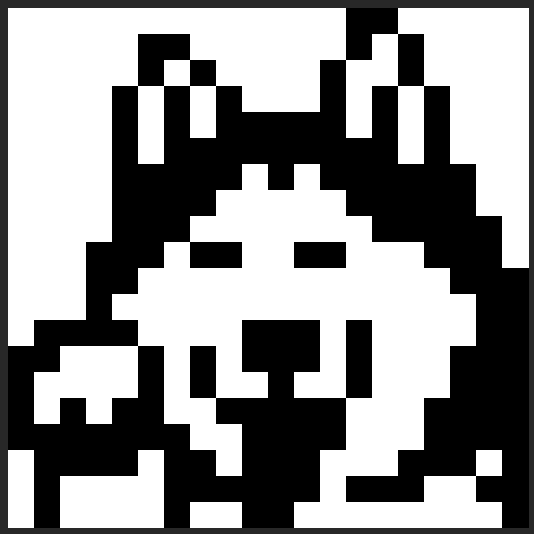
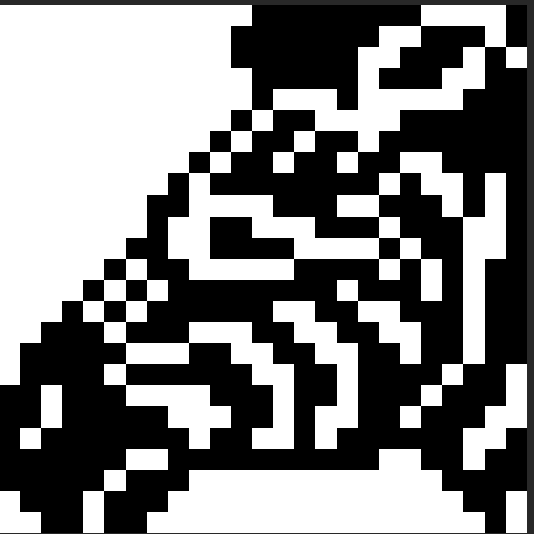
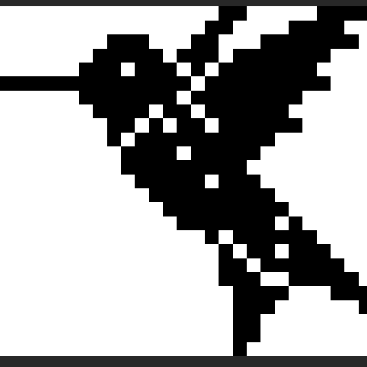
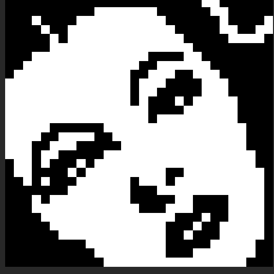
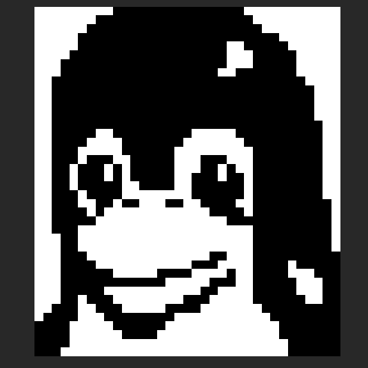
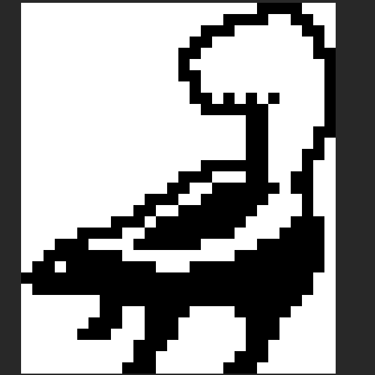
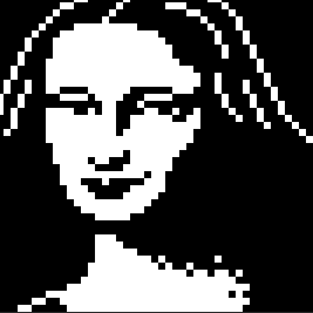
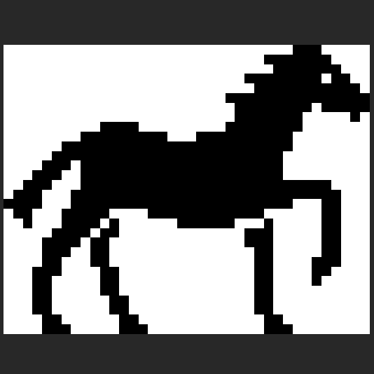
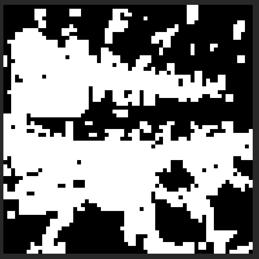
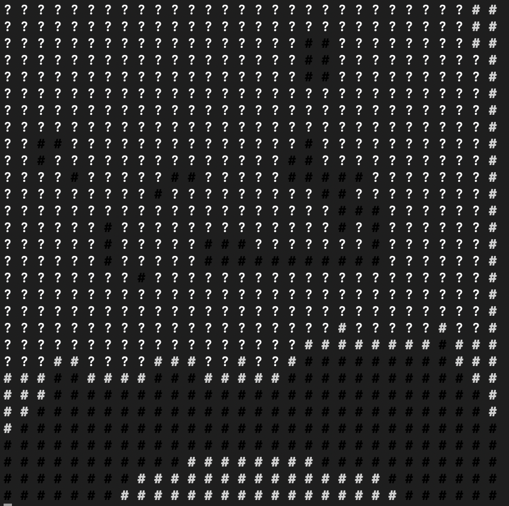

# Un problème de tomographie discrète S6 2023 - 2024

## Introduction

## DEPRECATED notice

Le development de la resolution du jeu a passé par plein differents stages et surtout pleines heures de reflexion selon la methode "try and error". Avec la finalisation du programme, le fonctions qui ne sont pas utilisé pour la resolution du probleme sont tagé comme `DEPRECATED`.

## Question 1

Si l'on a calculé tous les (T(j, l), pour savoir s'il est possible de colorier la ligne li entière avec la séquence entière, il suffit de regarder la valeur de T(M-1, k) avec k entre 1 et l. Il faut noter que M représente le nombre total de colonnes dans la ligne en question.

La valeur de T(M-1, k) nous indique s'il est possible de placer le k-ième bloc dans la ligne de manière à ce que tous les blocs \( s_1, s_2, ..., s_k \) soient placés correctement selon les règles du jeu. En revanche, si T(M-1, k) est vrai, cela signifie qu'il y a une façon de colorier toute la ligne en respectant les contraintes des séquences de blocs noirs.

Maintenant qu’on sait qu’on peut colorier toute la ligne, il faut prouver que c’est la seule solution. La condition de l’unicité est T(M-2,k) est FALSE qui veut dire que pour une indice avant l'indice maximale des colones pour laquelle on a la condition verifié, on regarde qu'il faut avoir comme reponse egale à faux parce que normallement il n'y a pas de cases suffisantes pour que cette condition est aussi correct.

## Question 2

Les cas de base de l'algorithme récursif pour remplir la table **T(j, l)** sont essentiels pour établir les conditions initiales qui vont guider la construction de la solution. Selon les conditions du jeu on a:

* Case 1

  * Dans ce cas, il n'y a aucun bloc noir à placer, donc peu importe la valeur de  **j** , la ligne peut toujours être colorée en blanc jusqu'à la case  **j** . Cela signifie que pour  **l = 0** , tous les **T(j, 0)** sont vrais, car une séquence vide est toujours possible.
  * Ainsi, il faut retourner toujours TRUE.
* Case 2

  * Option a (j < sl − 1)

    * Si j est inférieur à  sl - 1, cela signifie que l'espace disponible est insuffisant pour le premier bloc de taille sl . Dans ce cas, il n'est pas possible de placer un bloc de taille **sl** dans les j+1 premières cases.
    * Alors il va retourner toujours FALSE cette cas
  * Option b (j = sl − 1)

    * Si j est égal à  sl - 1 , cela signifie que l'espace disponible est juste suffisant pour placer le premier bloc de taille sl et rien d'autre. Dans ce cas, le coloriage est possible si et seulement si l = 1.
    * Ainsi il va retourner TRUE si on est à s1 parce que on sait forcement qu'il n'y a pas une autre sequence à traiter. Par contre pour sl, si l > 1, alors on ne peut pas être sur si la prochaine sequence pourrait etre traité de debut à la fin.

## Question 3

Soit j' < j et l' <= l. On propose la recurence suivante:

* Si (i, j) est blanc alors T(j, l) = T(j - 1, l)
* Si (i, j) est noir alors T(j - sl -1, l - 1)

**Si la case ((i,j) est blanche :** Cela signifie que la configuration qui termine à la case ((i,j−1) doit déjà être valide pour les blocs. Donc, T(j,l) est vrai si T(j−1,l) est vrai.
**Si la case (i,j) est noire :**  nous voulons vérifier si le bloc de sl cases noires peut se terminer à la case  j, donc nous devons regarder sl cases avant la case  j et aussi compter une case supplémentaire pour l'espace blanc obligatoire. Cela signifie que nous regardons à la position j − sl − 1 . Si T ( j − sl − 1 , l − 1 )  est vrai, cela signifie qu'il est possible de placer les l − 1  premiers blocs dans les premières j − sl − 1  cases, ce qui laisse juste assez d'espace pour que le bloc sl soit placé à la fin.

On applique tous ceux notions sur le pseudocode proposé ci-dessous pour la question 4.

## Question 4

```python
bool T(l, j, tab, seq)
Entree: indice de collogne j, indice de la sequence l, addresse du tableau des lignes, addresse du tableau des sequences

si (l = 0) alors
	retourner TRUE
finsi
si (l >= 1) alors
	si (j < seq[l] -1) alors
		retourner false
	finsi
	si (j = seq[l] - 1) alors
		si (l = 1) alors
			retourner true
		sinon
			retiurner false
		finsi
	finsi
	si (j > seq[l] - 1) alors
		si (T(l, j-1, tab, seq) || T(l-1, j - seq[l] - 1, tab, seq)) alors
			retourner true
		sinon
			retourner false
		finsi
	finsi
finsi
```

Trouver la fonction finale selon les modifications demandé en question 5 à la question 7.

## Question 5

On propose les modifications suivantes:

1. Dans le cas 2b, on verifie si on trouve une case blanche pour l'intervalle de 0 à j-1. Si une telle case existe alors automatiquement la sequence en question n'est pas valable, ainsi on retourne false. Sinon si ce premier test est passé, on a retourne true si et seulemt si l = 1 comme avant.
2. Dans le cas 2c, on regarde si la case tab[j] est blanche. Si c'est le cas, il faut qu'on se deplace une position à gauche `T(j - 1, l, tab, seq)` et on re-test. Si ce n'est pas le cas, on dans une de deux cas ci-dessous:

   * Soit la case est noir
   * Soit la case n'est pas colorié

   Alors on continue d'appeler recursivement selon la relation de recurssion trouvé à la question 3.

## Question 6

La complexité de la fonction T dépend de la façon dont les appels récursifs se déroulent. Dans le pire des cas, on peut observer une complexité exponentielle parce que :

* Cas de base : Si la longueur de la séquence l est nulle, la fonction retourne `true` - complexité O(1).
* Cas récursifs :

  * Si la position courante j est inférieure à la valeur attendue selon la séquence, la fonction retourne `false` O(1).
  * Si j correspond à la fin d'un élément de la séquence, la fonction parcourt les cases de 0 à j-1. Ce parcours peut aller jusque à M éléments dans le pire des cas, ce qui représente une complexité de O(M).
  * D'autre cote, si j dépasse la fin d'un élément de la séquence, la fonction effectue deux appels récursifs, pouvant mener à une situation où chacun de ces appels en déclenche deux autres, et ainsi de suite. Cette situation crée une arborescence d'appels qui grandit de manière exponentielle par rapport à M

  Ainsi la complexité globale est O(2^M)

Effectivement, il y a des scenarios ou l'algorithme finis plus rapidement que prevu, par exemple:

* Si la boucle dans le deuxième cas récursif rencontre une case blanche (`WHITE`), la fonction retourne `false` immédiatement, stoppant la recursion sur cette branche.
* Si la longueur de la séquence l possède une borne supérieure constante (indépendante de M), la profondeur de la recursion sera limitée, pouvant mener à une complexité inférieure.

## Question 7

### L'algorithme

```c
bool T_v2(int j, int l, int *tab, int *seq)
{
    // Checking wheter we have wrong-colorised a cell during a decision that
    // doesn't respect the maximum amount of cells that can be colorised
    if (count_black_cells(tab, j + 1, 1) > count_black_cells(seq, l, 2))
    {
        return false;
    }

    // ================
    // Case 1
    // ================

    /* This is the case were everything is possible */
    if (l == 0)
    {
        return true;
    }

    // ================
    // Case 2a
    // ================

    if (j < seq[l - 1] - 1) // please consider that is seauence seq the place at seq[0] is never used on our program. It's just initialises on a nunber that we never take into consideration
    {
        return false;
    }

    // ================
    // Case 2b
    // ================

    /* It can be true if and only if there is only one sequence. Otherwise
       it's not possible to treat the rest of sequences in that available number of
       cells. If it finds a white cell then the sequence is not valid and returns false */
    if (j == seq[l - 1] - 1)
    {
        if (l == 1)
        {
            for (int i = 0; i < seq[l - 1]; i++)
            {
                if (tab[j - i] == WHITE)
                {
                    return false;
                }
            }

            return true;
        }
        else
        {
            return false;
        }
    }

    // ================
    // Subcases for 2c
    // ================

    /* Checking if current index is black and perfom sequence verification */
    if (tab[j] == BLACK)
    {
        // Case where after the sequence the next cell is white or not coloured. In that case we move on for the next seqence (l - 1)
        if (tab[j - seq[l - 1]] == WHITE || tab[j - seq[l - 1]] == DEFAULT)
        {
            int i;
            for (i = j; i > j - seq[l - 1]; i--)
            {
                if (tab[i] == WHITE)
                {
                    return false;
                }
            }

            return (T_v2(j - seq[l - 1] - 1, l - 1, tab, seq));
        }

        /* After the sequence there is a black cell that under normal circomstances
       it should be white for the sequence to be valid in that position. So it's false in that case. */
        if (tab[j - seq[l - 1]] == BLACK)
        {
            return false;
        }
    }

    /* After the sequence there is a black cell that under normal circomstances
       it should be white for the sequence to be valid in that position. However
       it is not the case and we need to check for the same sequence once step
       on the left before we can conclude. */
    if (tab[j - seq[l - 1]] == BLACK)
    {
        return (T_v2(j - 1, l, tab, seq));
    }

    /* The sequence was valid for the local search that was perfomed on index j and
       on index j - seq[l] (black exclusivly), so last but not least we need to perform
       a global test. If there is a white cell that is found then we move on one step
       on the left as usual according to question 3. */
    int i;
    for (i = j; i > j - seq[l - 1]; i--)
    {
        if (tab[i] == WHITE)
        {
            return T_v2(i - 1, l, tab, seq);
        }
    }

    return (T_v2(j - seq[l - 1] - 1, l - 1, tab, seq) || T_v2(j - 1, l, tab, seq));

    // everything fails so the response is false
    return false;
}
```

### Tests

On propose les tests ci-dessous:

```c
Basic cases

Test No 1
? The sequence is:  1 =>  TRUE
---------------------

Test No 2
# The sequence is:  1 =>  FALSE
---------------------

Test No 3
# The sequence is:  1 =>  TRUE
---------------------

Test No 4
# | ? | ? The sequence is:  3 =>  TRUE
---------------------


More complex cases

Test No 5
# | ? | ? The sequence is:  4 =>  FALSE
---------------------

Test No 6
# | ? | # The sequence is:  2 =>  TRUE
---------------------

Test No 7
# | ? | ? The sequence is:  2 =>  TRUE
---------------------

Test No 8
# | ? | ? The sequence is:  3 =>  FALSE
---------------------

Test No 9
# | ? | ? The sequence is:  0 =>  TRUE
---------------------


High complexity cases

Test No 10
? | ? | ? | ? | ? The sequence is:  2 | 1 | 1 =>  FALSE
---------------------

Test No 11
? | ? | ? | ? | ? | ? The sequence is:  3 | 2 =>  TRUE
---------------------

Test No 12
? | ? | ? | # | ? | ? The sequence is:  3 | 2 =>  TRUE
---------------------

Test No 13
# | ? | ? | # | ? | ? The sequence is:  3 | 2 =>  FALSE
---------------------

Test No 14
# | ? | ? | # | ? | # The sequence is:  3 | 2 =>  TRUE
---------------------

Test No 15
# | # | ? | # | ? | # The sequence is:  3 | 2 =>  FALSE
---------------------

Test No 16
# | ? | # | ? | ? The sequence is:  3 =>  FALSE
---------------------

Test No 17
# | # | ? | ? The sequence is:  1 | 2 =>  FALSE
---------------------

Test No 18
? | ? | ? | ? | ? The sequence is:  3 =>  TRUE
---------------------

Test No 19
? | ? | # | # | ? The sequence is:  3 =>  TRUE
---------------------

Test No 20
# | ? | ? | ? The sequence is:  3 =>  TRUE
---------------------

Test No 21
? | # | # | ? The sequence is:  1 | 1 =>  TRUE
```

Ces tests nous avos permis de conclure si la fonction T etait capable de passer par plein differents scenarios extremes et perturbants.

## Question 8

La boucle tant que s'exécute quand LignesAVoir ou ColonnesAVoir n'est pas vide. Alors, à chaque itération, au moins une case est coloriée, parce que ColoreLig et ColoreCol colorent au moins une case si possible. Ainsi le nombre total des itterations et N * M.

Maintenant, on se focalise sur la complexité de ColoreLig et ColoreCol, qui sont des fonctionnes reccursives. La profondeur de la récursivité est bornée par le nombre de cases dans une ligne/colonne, soit N ou M respectivement. Donc, la complexité de chaque fonction est O(N * M).

On peut conclure que la complexité totale est O(N * M) * O(N * M) = O((N * M)^2) qui est bien une complexité polynomiale comme attendu.

## Question 9

L'implementation de l'agorithm incomplet est le suivant:

```c
enum State color_grid_v2(int **grid, int n_rows, int n_columns, int **rows_columns, int maximum)
{
    // NOTE: x is for horizontal (lines) and y is for vertical (columns) on grid's 2D array
    while (grid_defaults_count(grid, n_rows, n_columns) != 0)
    {
        for (int x = 0; x < n_rows; x++)
        {
            // This first test checks whether we need to proceed to line analysis or not.
            //  If the sequence can be applied directly with any cells uncolorised,
            //  then we coulorise them and we move on to the next line
            int pre_l = correct_length(rows_columns[x], maximum);
            int nb_blacks = count_black_cells(rows_columns[x], pre_l, 2);
            int nb_whites = pre_l - 1;
            if ((nb_blacks + nb_whites) == n_columns)
            {
                color_lineORcolumn(grid[x], rows_columns[x], n_columns);
            }
            else
            {
                for (int y = 0; y < n_columns; y++)
                {
                    /* If no color is aplied yet to the specific cell */
                    if (grid[x][y] == DEFAULT)
                    {
                        int l;
                        bool white_test, black_test;

                        // ==========================
                        // Local test for white state
                        // ==========================
                        grid[x][y] = WHITE;

                        // Analysis of the line in question (in parallel of every column for this line [this is done with every change of y])
                        int *tab = (int *)malloc(n_rows * sizeof(int)); // The number of rows is the length of the column in question
                        if (tab == NULL)
                        {
                            fprintf(stderr, "\nFailed to allocate memory for tab.\n");
                            exit(-1);
                        }

                        // Isolation of the column for the current y
                        column_isolation(grid, y, n_rows, tab);

                        /* HORIZONTAL test */
                        l = correct_length(rows_columns[x], maximum);
                        white_test = T_v2(n_columns - 1, l, grid[x], rows_columns[x]);

                        /* VERTICAL test */
                        if (white_test)
                        {
                            l = correct_length(rows_columns[n_rows + y], maximum);           // updating l value
                            white_test = T_v2(n_rows - 1, l, tab, rows_columns[n_rows + y]); // we need + 1 because y counts from 0, so in order to take the correct sequence for the column, we need n_rows + 0 + 1 to be distinguised
                        }

                        // ==========================
                        // Local test for black state
                        // ==========================
                        grid[x][y] = BLACK;
                        tab[x] = BLACK; // This step is essential. Previsouly the colourisation in white happened before isolation. Here we have to do it manually because we have already isolated the column

                        /* HORIZONTAL test */
                        l = correct_length(rows_columns[x], maximum);
                        black_test = T_v2(n_columns - 1, l, grid[x], rows_columns[x]);

                        /* VERTICAL test */
                        if (black_test)
                        {
                            l = correct_length(rows_columns[n_rows + y], maximum);           // updating l value
                            black_test = T_v2(n_rows - 1, l, tab, rows_columns[n_rows + y]); // we need + 1 because y counts from 0, so in order to take the correct sequence for the column, we need n_rows + 0 + 1 to be distinguised
                        }

                        free(tab);

                        // ==========================
                        // Reversing any changes
                        // ==========================
                        grid[x][y] = DEFAULT;

                        // ==========================
                        // Decisions and conclusions
                        // ==========================
                        if (white_test == false)
                        {
                            if (black_test == false)
                            {
                                //printf("\n%d,  %d\n", x, y);
                                return FAIL;
                            }
                            else
                            {
                                grid[x][y] = BLACK;
                            }
                        }
                        else if (black_test == false)
                        {
                            if (white_test == true)
                            {
                                grid[x][y] = WHITE;
                            }
                            else
                            {
                                return NO_DECISION;
                            }
                        }
                    }
                    //printing_grid(grid, n_rows, n_columns, 3);
                }
                printing_grid(grid, n_rows, n_columns, 3);
            }
        }
    }

    if (grid_in_color(grid, n_rows, n_columns))
    {
        return SUCCESS;
    }
    else
    {
        return NO_DECISION;
    }
}
```

## Q10

En faisant une implimentation sur les instances 1.txt à 10.txt on obtiens les resultats ci-dessous (pour l'algorithme incomplet):

### Algorithme Incomplet

| Instance | Temps de resolution (T_v1) | Temps de resolution (T_v2)<br />OPTIMISÉ | Resultat                                       |
| -------- | -------------------------- | ----------------------------------------- | ---------------------------------------------- |
| 1.txt    | 0.00026125 seconds        | 0.000209 seconds                          |  |
| *2.txt   | 0.04201625 seconds         | 0.033613 seconds                          |  |
| 3.txt    | 0.01847375 seconds         | 0.014779 seconds                          |  |
| 4.txt    | 0.04183375 seconds         | 0.033467 seconds                          |  |
| 5.txt    | 0.04461875 seconds         | 0.035695 seconds                          |  |
| 6.txt    | 0.15211125 seconds        | 0.121689 seconds                          |  |
| 7.txt    | 0.05928625 seconds         | 0.047429 seconds                          |  |
| 8.txt    | 0.19354125 seconds        | 0.154833 seconds                          |  |
| *9.txt   | 173.42733375seconds        | 138.741867 seconds                        |  |
| *10.txt  | 471.59015625 seconds       | 377.272125 seconds                        |  |

Les instances avec * etait incomplet en utilisant la methode incplpet de l'algorithm. En outre, il faut noter qu'on onbserve une diminuation du temps de traitment par 25% en comparant les deux differents fonctions T.

Il faut noter que l'agorithms sont basés sur la logique des algorithmes de retour en arrière. La résolution de nonogrammes implique généralement un algorithme de retour en arrière, qui explore de multiples possibilités et se répète de manière approfondie, créant potentiellement un grand nombre de piles d'appels de fonctions. Chaque appel récursif nécessite de la mémoire pour les paramètres de fonction, les variables locales et les adresses de retour. C'est pourquoi, la consommation de la memoire augmente chaque fois qu'une combinaison choisi n'est pas validé les consignes des sequences.

## Q11

L'pplication de l'alorithme sur l'instance 11 retourne le resultat suivante:

```c
There is NO DECISION for the provided puzzle
The colourised grid is
? | ? | ? | ? 
? | ? | ? | ? 
```

En fait comme ca, l'agorithme ne peut pas conclure à cause d'un chauvechement des incertitudes.

## Q12

Pendant chaque appel récursif de `color_grid_complet`, il peut y avoir plusieurs sous-appels en fonction du résultat de l'attribution de couleur de la cellule en question. Dans le pire des cas, l'algorithme devra peut-être essayer à la fois BLANC et NOIR pour chaque cellule, ce qui conduit à une profondeur de 2 pour chaque cellule. En outre, il y aura des scenarios ou une choix verifié va etre annulé parce que elle n'etait pas optimale pour le resultat totale de la resultation. Dans ce cas, l'algorithm reviens à cette etape et il reprend.

En combinant le nombre d'appels récursifs (n_rows * n_columns) et la profondeur de récursivité (2), la complexité temporelle globale devient : T(n) = n_lignes * n_colonnes * 2^n_lignes * n_colonnes ou encore T(n) = O(n^(lignes * colonnes)).

## Q13

Cette fois on obtiens la bonne reponse pour l'instance 11.txt


## Q14

Ci-dessous on va livrer la representation des images seulment pour les instances qui n'etait pas examiné à la question 10.

### Algorithme Complet


| Instance    | Temps de resolution (T_v2) | Resultat                                       |
| ----------- | -------------------------- | ---------------------------------------------- |
| 1.txt       | 0.000052 seconds           | -//-                                           |
| 2.txt       | 0.029618 seconds           | -//-                                           |
| 3.txt       | 0.003238 seconds           | -//-                                           |
| 4.txt       | 0.009310 seconds           | -//-                                           |
| 5.txt       | 0.009822 seconds           | -//-                                           |
| 6.txt       | 0.034539 seconds           | -//-                                           |
| 7.txt       | 0.011148 seconds           | -//-                                           |
| 8.txt       | 0.046059 seconds           | -//-                                           |
| 9.txt       | 112.841438 seconds         | -//-                                           |
| 10.txt      | 408.873291 seconds         | -//-                                           |
| 11.txt      | 0.000012 seconds           | -//-                                           |
| 12.txt      | 0.033768 seconds           |  |
| 13.txt      | 0.544291 seconds           |  |
| 14.txt      | 0.022434 seconds           |  |
| 15.txt      | 0.082423 seconds           |  |
| 16.txt      | 530.418396 seconds         |  |
| **flag.txt  | 3.631973 seconds           |  |
| **photo.txt | 15.876246 seconds          |  |

**Voir la paragraph pour aler plus loin

### **Commentaires**

On observe observe que le temps de resolution a diminue par rapport la methode de resolution incomplet. Maintenant, en ce qui concerne nos observations pour les instances 12 à 16 tout en essayant les executer en utilisant la methode incomplet, on a:

* Il sont bloques sur une boucle infinies sans qu'il change quelque chose...
* ....
* ....

### Instance 15

Pour l'instance 15 on obtiens les resultats ci-dessous:

| Algorithm 1.3 (version 2)                      | Algorithm 2 (version 3)                        |
| ---------------------------------------------- | ---------------------------------------------- |
|  |  |

## Pour aller plus loin

On essayé de creer notre nonogram personalise avec deux differents objectifs:

1. Affichage de numeros et des texts sur la grille
2. Representation d'une image par un nonogram

Le premier objectif est assez simpple à reasiler. Pour la deuxieme voici les etapes qu'on a suivi:

1. Selectioner une image et faire un crop carré 1x1
2. Utiliser un outil en ligne permetant de le rendre uniquement en pixels noir et blanchs (https://www.resizepixel.com/convert-image-to-black-white/)
3. Pour obtenir les sequences du jeu on a:
   1. Sur le dossier image_encoding il y a un program MATLAB `main_program.m` qui accepte n'importe quelle image PNG
   2. On choisi le ratio de division (si on veut diminuer la taille du nonogram et le simplifier en general)
   3. Le script va creer un fichier excel qui contiens les sequences
   4. Il suffit de faire un copier coller des sequences des lignes et des collognes sur un fichier .txt tout en resepctant la syntaxe introduit au sujet
   5. Vue que les instances sont separe par un dash '-', on a develope un program sur python `encoding.py` qui viens de finir l'encodage du fichier pour qu'il soit utilisable par le code. Il faut noter que le fichier .txt faut etre sur le repertoir instances pour qu'il soir detectable par le program.
      ```python
      def replace_hyphens(filename):
        """Reads a text file, replaces hyphens with spaces, and saves the modified content to the same file."""
        with open(filename, 'r') as f:
          content = f.read()
        modified_content = content.replace('-', ' ')
        with open(filename, 'w') as f:
          f.write(modified_content)

      # Example usage
      filename = "instances/photo.txt"
      replace_hyphens(filename)
      print(f"Replaced hyphens with spaces in {filename}")

      ```
4. Mainteant on peut utiliser le fichier .txt de l'instance construit.

Nos deux insatnces construits suivant les deux objectifs sont **flag.txt** et **photo.txt** respectivement. Effectivement à cause des simplifcations et des limitations des fichiers PBM (utilése pour sauvegarder les donnes comme des images pixeléses sur la machine), le fichier photo.pbm (disponible sur le repertoire tests) n'est pas une image claire mais c'est proche à l'image originale.

## Exit codes

Vous trouverez ci-dessous la définition et l'explication des codes de sortie de nos programmes :

| Code      | Status | Explanation                                                     |
| --------- | ------ | --------------------------------------------------------------- |
| exit(-10) | ERROR  | There is a memory allocation error on color_grid_v1 for columns |
| exit(-11) | ERROR  | There is a memory allocation error on color_grid_v1 for rows    |
| exit(-1)  | ERROR  | There is a memory allocation error on color_grid_v2 for columns |
| exit(-2)  | ERROR  | There is a memory allocation error on color_grid_v2 for rows    |
| exit(-5)  | ERROR  | Wrong option was returned on menu                               |
| exit(-3)  | ERROR  | allocation_error_print_general retrurned                        |
| exit(-4)  | ERROR  | allocation_error_print_with_id returend                         |
| exit(-6)  | ERROR  | midle_menu function did not return the correct result           |
| exit(-8)  | ERROR  | PBM file creation failed                                        |
| exit(1)   | ERROR  | EPS file creation failed                                        |
| exit(-9)  | ERROR  | Couldn't open the tests file                                    |

## Versioning

Le versioning est un élément clé en programmation, assurant la cohérence des modifications et facilitant la collaboration. Il est aussi primordial pour la récupération de données en cas de perte ou corruption. Au fil du projet, nous avons créé différentes versions de notre code, chacune marquant une étape importante de son évolution. Cela nous a permis de suivre les progrès, d'intégrer de nouvelles fonctionnalités et d'effectuer des corrections de manière structurée.

Voici les differentes versions dévelopées lors de l'evolution du projet :

* **V4.0** Base code was added/created
* **V4.1** Project started. The 1.1 has been completed partially. The base cases work but when we check for a more complex one, the answers are not the best.
* **V4.2** Corrections, bug fixes and compte rendu completed until Question 7
* **V4.3** Question 8 answered and we started the read_file function for the propagation program asked on question 9. Many things need to be done in order for 1st stage of the project to be completed:

* [ ] Finish the read_file function (and its organisation)
* [ ] Write the colorization's algorithm logic in C[ ]  Use the T function maybe to analyse line by line
* [ ] Create an initialization function for the gred according to the M and N read from the file (setting every case to DEFAULT because in the beginning it's not colorised)
* [ ] See how to treat the colorisation in general

* **V4.4** Tests for file's decodation have been passed. AN initialisation function of grid and main program for part 1.3 have been completed. Only the treating algorithm remains
* **V4.5** Algorithm for Q9 has been completed but it's not working properly. Probably there is an index issue or something. Needs to be tested with the debuging tools. Moreover needs to be checked the case where we input a file name that is not at all acppeted (it doesn't exist) but the program instead of doing what it is supposed to do (say that opening the file is imposisble), instead it prints the rest of the UI.
* **V4.6** The program has been completed in a great percentage
* **V4.7** The color_llineORcolumn needs some corrections for 0.txt and the rest on the logic
* **V4.9** The algorithm (v3 and v2) are much better but they do not return exactly the correct solution. There should be an error somewhere.
* **V4.10** Updated fuction T. We need now to fix the issue with the v3 function doesn't colour correctly all the cases.
* **V4.11** Updated function T but still not finished yet. There are some errors
* **V4.12** Code correction on logic
* **V4.13** Optimization, formalization and completion

## Conclusion

Le développement de notre solution du jeu nonogram a été une expérience formatrice et enrichissante, nous offrant des compétences précieuses en programmation et en résolution de problèmes. Toutefois, il reste des possibilités d'amélioration pour augmenter l'attrait et la performance du jeu.

Actuellement, notre jeu fonctionne avec une interface en ligne de commande, mais pour le rendre plus interactif et esthétique, l'ajout d'une interface graphique, via des bibliothèques externes comme GTK+, Qt ou SDL (ouverture des jeu resolu comme une image blanc ou noir), est envisageable. Cette amélioration nécessiterait toutefois des compétences et installations supplémentaires. Par ailleurs, optimiser l'algorithme d'exploration (si possible) augmenterait l'efficacité du jeu.

Bien que ces améliorations soient ambitieuses, elles promettent d'ouvrir des voies passionnantes pour le développement futur de notre jeu.

## Copyright

###### Yanis Sadoun, Vasileios Filippos Skarleas | 2023 - 2024 All rights reserved
