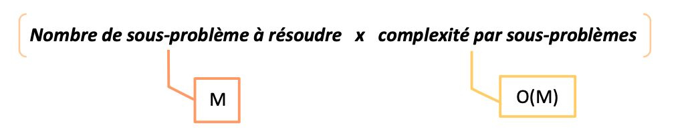
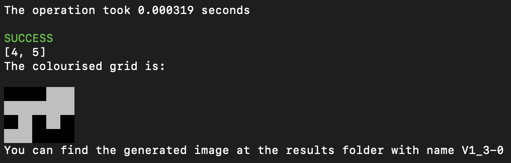
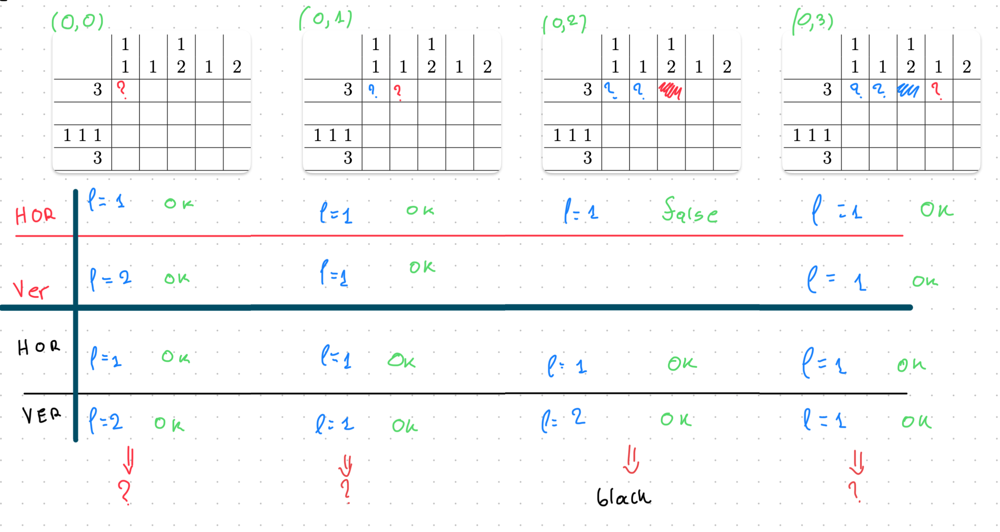
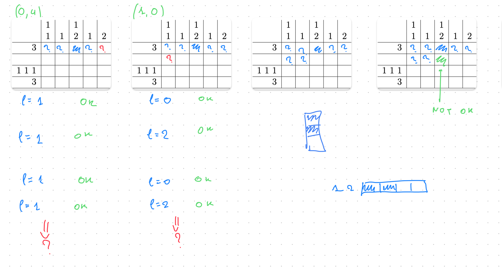

# Un problème de tomographie discrète S6 2023 - 2024

## Introduction

Ce rapport s'inscrit dans le cadre de l'unité d'enseignement Algorithme du semestre 6 du programme de robotique. Il présente notre démarche et nos solutions apportées à un projet captivant et stimulant : le développement d'un algorithme pour résoudre un jeu de tomographie discrète, plus communément connu sous le nom de Nonogram ou Picross.

Ce jeu de réflexion, joué en solitaire, pose un défi de taille : découvrir un dessin caché en coloriant une grille de cases en noir et blanc, en se basant uniquement sur des indices numériques situés à ses bords. Ces indices fournissent des séquences d'entiers représentant les longueurs des blocs de cases noires pour chaque ligne (𝑙𝑖) et chaque colonne (𝑐𝑗), numérotées respectivement de 0 à N-1 et de 0 à M-1.

Le cœur de notre projet est donc la construction d'une solution qui permette de visualiser un dessin à travers un processus de coloriage respectant scrupuleusement les contraintes fournies par ces séquences. Chaque bloc de cases noires doit être séparé par au moins une case blanche, et il est possible que la grille commence ou se termine par des cases blanches.

Notre objectif est double : non seulement développer une méthode efficace et fiable pour résoudre ce type de puzzles, mais également approfondir notre compréhension des techniques algorithmiques et de leur application dans des contextes ludiques mais complexes.

## Instructions

Pour démarrer le programme (test de la fonction (T) [version 2], application des résolutions sur des instances spécifiées, ou encore résolution automatique des instances sélectionnées), veuillez suivre les instructions d'installation automatique :

1. Téléchargez le dossier "Source Code".
2. Ouvrez un terminal et naviguez jusqu'au dossier contenant le code source du projet téléchargé.
3. Saisissez `chmod 777 run.sh` dans le terminal, puis lancez le script avec `bash run.sh`. Suivez simplement les instructions affichées dans le terminal pour explorer les différentes fonctionnalités du programme.
4. Assurez-vous que toutes les instances soient conformes au format décrit dans le document du projet et qu'elles soient placées dans le dossier `instances` du répertoire Source Code.
5. Pour l'option `auto`, assurez-vous d'avoir préalablement ajouté les instances désirées dans le dossier `instances`. Ensuite, ouvrez et ajustez le fichier `list.txt` en y inscrivant les noms des instances à traiter.

## I- Méthode incomplète de résolution

La méthode incomplète de résolution que nous avons explorée pour ce projet s'articule autour d'un processus itératif visant à simplifier le problème initial de tomographie discrète en identifiant les cases dont la couleur peut être déterminée directement à partir des contraintes données. Cette approche, bien qu'elle ne garantisse pas la résolution complète du puzzle pour toutes les instances, permet de réduire considérablement l'espace de recherche et de poser les fondations pour des stratégies de résolution plus avancées.

### 1.1/Première étape

#### Question 1

Si l'on a calculé tous les T(j, l), pour savoir s'il est possible de colorier la ligne 𝑙𝑖 entière avec la séquence entière, il suffit de regarder la valeur de T(M-1, k) avec k entre 1 et l. Il faut noter que M représente le nombre total de colonnes dans la ligne en question.

La valeur de T(M-1, k) nous indique s'il est possible de placer le k-ième bloc dans la ligne de manière à ce que tous les blocs ( s_1, s_2, ..., s_k ) soient placés correctement selon les règles du jeu. En revanche, si T(M-1, k) est vrai, cela signifie qu'il y a une façon de colorier toute la ligne en respectant les contraintes des séquences de blocs noirs.

L'unicité de la solution est assurée si la condition T(M−2,k) est fausse. Cela signifie qu'à l'indice juste avant le dernier dans la ligne, l'arrangement ne permet pas de placer tous les blocs conformément à la séquence imposée. En d'autres termes, si  T(M−2,k) est faux, cela indique qu'il n'existe pas suffisamment de cases disponibles pour répondre aux exigences de la séquence avant d'atteindre la fin de la ligne, renforçant ainsi l'idée que l'arrangement trouvé est le seul qui respecte les contraintes.

#### Question 2

Les cas de base de l'algorithme récursif pour remplir la table **T(j, l)** sont essentiels pour établir les conditions initiales qui vont guider la construction de la solution. Selon les conditions du jeu on a:

* **Cas 1: (l = 0) (aucun bloc)**

  * Lorsqu'aucun bloc noir n'est à placer (l = 0), la séquence de blocs est vide. Dans ce cas, peu importe la position (j) le long de la ligne, la condition pour colorier la ligne jusqu'à la case (j) en respectant une séquence vide est toujours satisfaite, puisqu'une absence totale de blocs peut toujours être représentée par des cases blanches.
  * **Conclusion :** (T(j, 0)) est vrai pour tout (j), reflétant la possibilité de remplir toute portion de la grille en blanc sans contrainte.
* **Cas 2*

On dénombre alors 3 cas différents -> Il y a au moins un bloc dans notre séquence:

* Option a: (j < sl − 1)
* Si j est inférieur à  sl - 1, cela signifie que l'espace disponible est insuffisant pour le premier bloc de taille sl . Dans ce cas, il n'est pas possible de placer un bloc de taille **sl** dans les j+1 premières cases.
* **Conclusion :** Dans ce cas, (T(j, l)) est faux, car l'espace ne permet pas d'accueillir le bloc.
* Option b: (j = sl − 1)
* Si (j) correspond exactement à l'espace requis pour le bloc (s_l) (le premier bloc dans ce contexte), alors la ligne peut être colorée conformément à la séquence uniquement si cette séquence est composée du seul bloc (s_l). Cela suppose qu'aucun autre bloc ne doit être placé après (s_l) pour que la condition soit vraie.
* **Conclusion :** (T(j, l)) est vrai si (l = 1), car le bloc peut être placé exactement dans l'espace disponible. Pour (l > 1), la condition est plus complexe et dépend des blocs subséquents dans la séquence.

#### Question 3

Soit j' < j et l' <= l. On propose la recurence suivante:

* Si (i, j) est blanc alors T(j, l) = T(j - 1, l)
* Si (i, j) est noir alors T(j - sl -1, l - 1)

**Si la case ((i,j) est blanche :** Cela signifie que la configuration qui termine à la case ((i,j−1) doit déjà être valide pour les blocs. Donc, T(j,l) est vrai si T(j−1,l) est vrai.
**Si la case (i,j) est noire :**  nous voulons vérifier si le bloc de sl cases noires peut se terminer à la case  j, donc nous devons regarder sl cases avant la case  j et aussi compter une case supplémentaire pour l'espace blanc obligatoire. Cela signifie que nous regardons à la position j − sl − 1 . Si T ( j − sl − 1 , l − 1 )  est vrai, cela signifie qu'il est possible de placer les l − 1  premiers blocs dans les premières j − sl − 1  cases, ce qui laisse juste assez d'espace pour que le bloc sl soit placé à la fin.

On applique toutes ces notions sur le pseudo-code proposé ci-dessous:

#### Question 4

```python
bool T(l, j, tab, seq)
Entree: indice de collogne j, indice de la sequence l, addresse du tableau des lignes, addresse du tableau des sequences

si (l = 0) alors
	retourner TRUE
finsi
si (l >= 1) alors
	si (j < seq[l] -1) alors
		retourner false
	finsi
	si (j = seq[l] - 1) alors
		si (l = 1) alors
			retourner true
		sinon
			retiurner false
		finsi
	finsi
	si (j > seq[l] - 1) alors
		si (T(l, j-1, tab, seq) || T(l-1, j - seq[l] - 1, tab, seq)) alors
			retourner true
		sinon
			retourner false
		finsi
	finsi
finsi
```

La fonction finale, intégrant les modifications suggérées a la question 5, est disponible à la question 7.

### 1.2/Généralisation

##### Question 5

On propose les modifications suivantes:

1. Dans le cas 2b, on verifie si on trouve une case blanche pour l'intervalle de 0 à j-1. Si une telle case existe alors automatiquement la sequence en question n'est pas valable, ainsi on retourne false. Sinon si ce premier test est passé, on  retourne true uniquement si l=1, conformément à la règle originale.
2. Dans le cas 2c, la première étape consiste à examiner si la case à l'indice j est blanche. Si tel est le cas, l'algorithme doit se déplacer d'une case vers la gauche, c'est-à-dire appeler T(j - 1, l, tab, seq) pour réévaluer la situation à partir de cette nouvelle position. Si la case n'est pas blanche, deux possibilités se présentent :

   * Soit la case est noire
   * Soit la case n'est pas coloriée

Alors, on continue d'appelé recursivement selon la relation de recurssion trouvé à la question 3.

#### Question 6

Dans ce contexte, l'évaluation de T(j, l) est effectuée récursivement pour une ligne de M colonnes. Pour déterminer la complexité globale de cette opération, il est essentiel de commencer par examiner la complexité associée à chaque calcul de T(j, l).

Chaque calcul a une complexité de O(M), étant donné que nous procédons à des vérifications sur M colonnes . En considérant que nous avons M telles valeurs à evaluer, nous devons également intégrer cette répétitivité dans notre analyse de compléxité.

Par ailleurs, la formule générale pour déterminer la complexité d’un algorithme basé sur la programmation dynamique est le produit du nombre de sous-problèmes à résoudre par la complexité de résolution d’un sous-problème individuel.



Dans notre cas, puisque chaque évaluation de T(j, l)implique potentiellement une analyse sur l’ensemble de la ligne avec des appels récursifs pour tenir compte des cases déjà colorées, la complexité totale s’exprime en O(M^2)(complexité quadratique).

#### Question 7

##### L'algorithme

Fonction : T_v2 (Vérifie la validité lors de la résolution du puzzle)

*Entrées:*

- j : index de la cellule actuelle (entier)
- l : Indice de la séquence actuelle (entier)
- onglet : grille de nonogrammes (tableau d'entiers) (probablement NOIR = 1, BLANC = 0)
- seq : longueurs de séquence pour une ligne/colonne (tableau d'entiers)

*Sortie:*

- bool : True si une configuration valide existe, False sinon

*Algorithme:*

1. Vérifiez la violation maximale des cellules :

   - Si il y a deja un nombre de cellules colories en noir superieur par celui que l'instance attend :
     - Renvoie False (trop de cellules noires après la position actuelle)
2. Cas 1 : Toutes les séquences traitées :

   - Si l == 0 :
     - Renvoie True (configuration valide)
3. Cas 2a : Séquence hors limites :

   - Si j < seq[l - 1] - 1 :
     - Return False (la séquence ne correspond pas)
4. Cas 2b : Vérification d'une séquence unique :

   - Si j == seq[l - 1] - 1 :
     - Boucle de j vers j - seq[l - 1] + 1 :
       - Si tab[i] == BLANC :
         - Renvoie False (cellule blanche inattendue dans la séquence)
     - Return (l == 1) // True si et seulment si seule séquence valide, False sinon
5. Sous-cas pour la séquence avec cellule noire à l'indice actuel (j) :

   - Si tab[j] == NOIR :
     - **Cas 2c-i : fin de séquence valide et vérification de la cellule suivante :**
       - Si tab[j - seq[l - 1]] == BLANC || tab[j - seq[l - 1]] == PAR DÉFAUT :
         - Boucle de j vers j - seq[l - 1] + 1 :
           - Si tab[i] == BLANC :
             - Renvoie False (cellule blanche inattendue dans la séquence)
         - Retourner T_v2(j - seq[l - 1] - 1, l - 1, tab, seq) // Vérifier la séquence suivante
       - Sinon (la cellule suivante est noire) :
         - Return False (structure de séquence invalide)
     - **Cas 2c-ii : Vérifiez la même séquence, un pas à gauche :**
       - Si tab[j - seq[l - 1]] == NOIR :
         - Return T_v2(j - 1, l, tab, seq) // Vérifiez la même séquence une cellule à gauche
6. Vérification globale de la séquence :

   - Boucle de j vers j - seq[l - 1] + 1 :
     - Si tab[i] == BLANC :
       - Return T_v2(i - 1, l, tab, seq) // Vérification récursive avec une cellule blanche
   - Retour T_v2(j - seq[l - 1] - 1, l - 1, tab, seq) || T_v2(j - 1, l, tab, seq) // Essayer la séquence suivante ou décaler vers la gauche
7. Tout le reste échoue :

   - Renvoie False (aucune configuration valide trouvée)

##### Le code

```c
bool T_v2(int j, int l, int *tab, int *seq)
{
    // Checking wheter we have wrong-colorised a cell during a decision that
    // doesn't respect the maximum amount of cells that can be colorised
    if (count_black_cells(tab, j + 1, 1) > count_black_cells(seq, l, 2))
    {
        return false;
    }

    // ================
    // Case 1
    // ================

    /* This is the case were everything is possible */
    if (l == 0)
    {
        return true;
    }

    // ================
    // Case 2a
    // ================

    if (j < seq[l - 1] - 1) // please consider that is seauence seq the place at seq[0] is never used on our program. It's just initialises on a nunber that we never take into consideration
    {
        return false;
    }

    // ================
    // Case 2b
    // ================

    /* It can be true if and only if there is only one sequence. Otherwise
       it's not possible to treat the rest of sequences in that available number of
       cells. If it finds a white cell then the sequence is not valid and returns false */
    if (j == seq[l - 1] - 1)
    {
        for (int i = j; i > j - seq[l - 1]; i--)
        {
            if (tab[i] == WHITE)
            {
                return false;
            }
        }
        return (l == 1); // either true or false
    }

    // ================
    // Subcases for 2c
    // ================

    /* Checking if current index is black and perfom sequence verification */
    if (tab[j] == BLACK)
    {
        // Case where after the sequence the next cell is white or not coloured. In that case we move on for the next seqence (l - 1)
        if (tab[j - seq[l - 1]] == WHITE || tab[j - seq[l - 1]] == DEFAULT)
        {
            for (int i = j; i > j - seq[l - 1]; i--)
            {
                if (tab[i] == WHITE)
                {
                    return false;
                }
            }

            return (T_v2(j - seq[l - 1] - 1, l - 1, tab, seq));
        }
        else
        {
            /* After the sequence there is a black cell that under normal circomstances
               it should be white for the sequence to be valid in that position. So it's false in that case. */
            return false;
        }
    }

    /* After the sequence there is a black cell that under normal circomstances
       it should be white for the sequence to be valid in that position. However
       it is not the case and we need to check for the same sequence once step
       on the left before we can conclude. */
    if (tab[j - seq[l - 1]] == BLACK)
    {
        return (T_v2(j - 1, l, tab, seq));
    }

    /* The sequence was valid for the local search that was perfomed on index j and
       on index j - seq[l] (black exclusivly), so last but not least we need to perform
       a global test. If there is a white cell that is found then we move on one step
       on the left as usual according to question 3. */
    for (int i = j; i > j - seq[l - 1]; i--)
    {
        if (tab[i] == WHITE)
        {
            return T_v2(i - 1, l, tab, seq);
        }
    }

    return (T_v2(j - seq[l - 1] - 1, l - 1, tab, seq) || T_v2(j - 1, l, tab, seq));

    // everything fails so the response is false
    return false;
}
```

##### Tests

Les tetsts sont essentiels pour verifier le comportment de la fonctionne.  On propose les tests basics et complexes ci-dessous:

```c
Basic cases

Test No 1
? The sequence is:  1 =>  TRUE
---------------------

Test No 2
# The sequence is:  1 =>  FALSE
---------------------

Test No 3
# The sequence is:  1 =>  TRUE
---------------------

Test No 4
# | ? | ? The sequence is:  3 =>  TRUE
---------------------


More complex cases

Test No 5
# | ? | ? The sequence is:  4 =>  FALSE
---------------------

Test No 6
# | ? | # The sequence is:  2 =>  TRUE
---------------------

Test No 7
# | ? | ? The sequence is:  2 =>  TRUE
---------------------

Test No 8
# | ? | ? The sequence is:  3 =>  FALSE
---------------------

Test No 9
# | ? | ? The sequence is:  0 =>  TRUE
---------------------


High complexity cases

Test No 10
? | ? | ? | ? | ? The sequence is:  2 | 1 | 1 =>  FALSE
---------------------

Test No 11
? | ? | ? | ? | ? | ? The sequence is:  3 | 2 =>  TRUE
---------------------

Test No 12
? | ? | ? | # | ? | ? The sequence is:  3 | 2 =>  TRUE
---------------------

Test No 13
# | ? | ? | # | ? | ? The sequence is:  3 | 2 =>  FALSE
---------------------

Test No 14
# | ? | ? | # | ? | # The sequence is:  3 | 2 =>  TRUE
---------------------

Test No 15
# | # | ? | # | ? | # The sequence is:  3 | 2 =>  FALSE
---------------------

Test No 16
# | ? | # | ? | ? The sequence is:  3 =>  FALSE
---------------------

Test No 17
# | # | ? | ? The sequence is:  1 | 2 =>  FALSE
---------------------

Test No 18
? | ? | ? | ? | ? The sequence is:  3 =>  TRUE
---------------------

Test No 19
? | ? | # | # | ? The sequence is:  3 =>  TRUE
---------------------

Test No 20
# | ? | ? | ? The sequence is:  3 =>  TRUE
---------------------

Test No 21
? | # | # | ? The sequence is:  1 | 1 =>  TRUE
```

Ces tests nous ont permis de vérifier si la fonction (T) pouvait gérer efficacement une large gamme de scénarios extrêmes et complexes.

### 1.3/Propagation

Cette section détaille l'exploitation de notre fonction T pour identifier les cases qui doivent nécessairement être colorées en blanc ou en noir au sein d'une grille, en utilisant une méthode de propagation pour le coloriage partiel de celle-ci. L'approche de résolution commence avec une grille vierge et procède à l'examen de chaque ligne et colonne. Le but est de déterminer comment les colorier en s'appuyant sur l'algorithme décrit dans la section précédente. Lors de l'évaluation d'une case non colorée (i,j) de la ligne i, quatre scénarios se présentent :

- Si la case peut être colorée en blanc, nous procédons à son coloriage et vérifions si cela conduit à une configuration valide de la ligne.
- Si la case peut être colorée en noir, nous effectuons le coloriage et évaluons à nouveau la validité de la ligne.
- Si aucune des deux options ne mène à une solution valide, cela signifie que la grille ne peut pas être résolue avec les contraintes données.
- Si les deux options sont valides, aucune conclusion définitive ne peut être tirée pour cette case.

Lorsqu'une case présente une unique possibilité de coloriage qui mène à une configuration valide, notre fonction de propagation assigne cette couleur à la case concernée. En revanche, si plusieurs options de coloriage respectent les contraintes sans permettre de trancher, la case reste indéterminée pour le moment. Cette méthode nous permet d'avancer progressivement dans la résolution du puzzle, en éclaircissant les zones de certitude tout en laissant ouvertes les questions qui requièrent une analyse plus approfondie.

#### Question 8

Dans cette analyse, nous prenons en considération les (N) lignes et (M) colonnes de notre grille. Pour colorier les cases, l'algorithme examine chaque ligne et colonne, utilisant les séquences indiquées en bordure pour guider le processus. La méthode adoptée aborde d'abord les lignes individuellement, cherchant à résoudre autant que possible avant de passer aux colonnes. Une fois toutes les colonnes examinées, les modifications apportées peuvent influencer la résolution précédemment obtenue pour les lignes, nécessitant un nouvel examen de celles-ci. Ce cycle entre l'analyse des lignes et des colonnes se poursuit jusqu'à ce qu'une solution complète soit dégagée pour la grille.

La nature itérative et récursive de cette approche, alternant entre lignes et colonnes pour maximiser la résolution à chaque étape, suggère une complexité algorithmique de O(N^2 + M^2). Cette estimation repose sur le fait que chaque ligne et colonne est traitée de manière récursive, avec un effort dédié à maximiser la résolution à travers toute la grille. Ainsi, nous établissons que l'algorithme opère avec une complexité polynomiale, compatible avec des exécutions efficaces même pour des grilles de grandes dimensions.

#### Question 9

L'implémentation de l'agorithme de résolution incomplète est le suivant:

```c
enum State color_grid_v2(int **grid, int n_rows, int n_columns, int **rows_columns, int maximum)
{
    // NOTE: x is for horizontal (lines) and y is for vertical (columns) on grid's 2D array
    while (grid_defaults_count(grid, n_rows, n_columns) != 0)
    {
        for (int x = 0; x < n_rows; x++)
        {
            // This first test checks whether we need to proceed to line analysis or not.
            //  If the sequence can be applied directly with any cells uncolorised,
            //  then we coulorise them and we move on to the next line
            int pre_l = correct_length(rows_columns[x], maximum);
            int nb_blacks = count_black_cells(rows_columns[x], pre_l, 2);
            int nb_whites = pre_l - 1;
            if ((nb_blacks + nb_whites) == n_columns)
            {
                color_lineORcolumn(grid[x], rows_columns[x], n_columns);
            }
            else
            {
                for (int y = 0; y < n_columns; y++)
                {
                    /* If no color is aplied yet to the specific cell */
                    if (grid[x][y] == DEFAULT)
                    {
                        int l;
                        bool white_test, black_test;

                        // ==========================
                        // Local test for white state
                        // ==========================
                        grid[x][y] = WHITE;

                        // Analysis of the line in question (in parallel of every column for this line [this is done with every change of y])
                        int *tab = (int *)malloc(n_rows * sizeof(int)); // The number of rows is the length of the column in question
                        if (tab == NULL)
                        {
                            fprintf(stderr, "\nFailed to allocate memory for tab.\n");
                            exit(-1);
                        }

                        // Isolation of the column for the current y
                        column_isolation(grid, y, n_rows, tab);

                        /* HORIZONTAL test */
                        l = correct_length(rows_columns[x], maximum);
                        white_test = T_v2(n_columns - 1, l, grid[x], rows_columns[x]);

                        /* VERTICAL test */
                        if (white_test)
                        {
                            l = correct_length(rows_columns[n_rows + y], maximum);           // updating l value
                            white_test = T_v2(n_rows - 1, l, tab, rows_columns[n_rows + y]); // we need + 1 because y counts from 0, so in order to take the correct sequence for the column, we need n_rows + 0 + 1 to be distinguised
                        }

                        // ==========================
                        // Local test for black state
                        // ==========================
                        grid[x][y] = BLACK;
                        tab[x] = BLACK; // This step is essential. Previsouly the colourisation in white happened before isolation. Here we have to do it manually because we have already isolated the column

                        /* HORIZONTAL test */
                        l = correct_length(rows_columns[x], maximum);
                        black_test = T_v2(n_columns - 1, l, grid[x], rows_columns[x]);

                        /* VERTICAL test */
                        if (black_test)
                        {
                            l = correct_length(rows_columns[n_rows + y], maximum);           // updating l value
                            black_test = T_v2(n_rows - 1, l, tab, rows_columns[n_rows + y]); // we need + 1 because y counts from 0, so in order to take the correct sequence for the column, we need n_rows + 0 + 1 to be distinguised
                        }

                        free(tab);

                        // ==========================
                        // Reversing any changes
                        // ==========================
                        grid[x][y] = DEFAULT;

                        // ==========================
                        // Decisions and conclusions
                        // ==========================
                        if (white_test == false)
                        {
                            if (black_test == false)
                            {
                                //printf("\n%d,  %d\n", x, y);
                                return FAIL;
                            }
                            else
                            {
                                grid[x][y] = BLACK;
                            }
                        }
                        else if (black_test == false)
                        {
                            if (white_test == true)
                            {
                                grid[x][y] = WHITE;
                            }
                            else
                            {
                                return NO_DECISION;
                            }
                        }
                    }
                    //printing_grid(grid, n_rows, n_columns, 3);
                }
                printing_grid(grid, n_rows, n_columns, 3);
            }
        }
    }

    if (grid_in_color(grid, n_rows, n_columns))
    {
        return SUCCESS;
    }
    else
    {
        return NO_DECISION;
    }
}
```

##### Instance 0



Comme observé, notre programme résout correctement l’exemple d’introduction.

### 1.4/Tests

#### Question 10

Suite à l'application de notre programme, utilisant l'algorithme incomplet, sur les instances allant de 1.txt à 10.txt, nous avons compilé les résultats obtenus dans le tableau ci-dessous :

##### Resultats du Solver

| Instance | Temps de resolution (T_v1) | Temps de resolution (T_v2)<br />OPTIMISÉ | Resultat                                       |
| -------- | -------------------------- | ----------------------------------------- | ---------------------------------------------- |
| 1.txt    | 0.00026125 seconds        | 0.000209 seconds                          |  |
| *2.txt   | 0.04201625 seconds         | 0.033613 seconds                          |  |
| 3.txt    | 0.01847375 seconds         | 0.014779 seconds                          |  |
| 4.txt    | 0.04183375 seconds         | 0.033467 seconds                          |  |
| 5.txt    | 0.04461875 seconds         | 0.035695 seconds                          |  |
| 6.txt    | 0.15211125 seconds        | 0.121689 seconds                          |  |
| 7.txt    | 0.05928625 seconds         | 0.047429 seconds                          |  |
| 8.txt    | 0.19354125 seconds        | 0.154833 seconds                          |  |
| *9.txt   | 173.42733375seconds        | 138.741867 seconds                        |  |
| *10.txt  | 471.59015625 seconds       | 377.272125 seconds                        |  |

Les instances avec * etaient incomplètes en utilisant la méthode de résolution incomplète. En effet, la manière d'implémentation de notre algorithme incomplet avait comme resultat de tourner à l'infinie pour ces instances là; c'est pourquoi on a utilisé la méthode de resolution complete (cf Question 13).

##### Nota Bene

Au cours du développement, nous avons créé deux versions de la fonction T ( disponible dans les programmes fournis). Une analyse comparative révèle que la seconde version permet de réduire le temps de traitement de 25% par rapport à la première. Cette amélioration significative s'explique en partie par la nature même des algorithmes utilisés.

Les deux algorithmes (color_grid_v2 inclus) s'appuient sur la stratégie de backtracking, couramment employée dans la résolution de nonogrammes. Cette approche consiste à explorer différentes possibilités à travers des appels récursifs successifs, ce qui, sans optimisation, peut entraîner une accumulation importante d'appels de fonction en mémoire. Chaque appel récursif alloue de l'espace pour les paramètres de la fonction, les variables locales et les adresses de retour. En conséquence, si une combinaison testée ne respecte pas les séquences requises, le processus d'élimination et de retour en arrière augmente la consommation de mémoire. La version améliorée de la fonction T semble donc offrir une gestion plus efficace des appels récursifs, optimisant le processus de backtracking pour réduire à la fois le temps de traitement et potentiellement l'empreinte mémoire.

#### Question 11

L'application de l'algorithme sur l'instance 11 retourne le resultat suivant:

```c
There is NO DECISION for the provided puzzle
The colourised grid is
? | ? | ? | ? 
? | ? | ? | ? 
```

En appliquant notre programme à l'instance 11.txt, nous avons constaté une particularité notable : la résolution partielle n'aboutit à aucune conclusion. Concrètement, aucune case n'est définitivement identifiée comme blanche ou noire ; toutes demeurent indéterminées. Ce phénomène s'explique par la manière dont notre algorithme de coloration opère. Cette fonction est conçue pour colorier uniquement les cases dont la couleur est assurée. Or, pour l'instance 11, il apparaît que chaque case pourrait théoriquement être colorée en blanc ou en noir sans violer les séquences fournies, car l'algorithme indique un potentiel de coloriage valide dans les deux sens, que ce soit en examinant les lignes ou les colonnes.

Cette situation révèle une limite de l'algorithme en cas de résolution partielle : si, lors du passage ligne par ligne puis colonne par colonne, aucun coloriage définitif n'est possible, l'ensemble des cases reste dans un état d'indétermination. Cela signifie que, malgré le respect des contraintes de séquence, notre programme ne peut pas, dans ce cas précis, déterminer un schéma de coloriage unique pour la grille.

Cela souligne donc l'importance de chercher  des stratégies complémentaires pour aborder les instances où l'approche partielle ne suffit pas à résoudre le puzzle.( cf méthode complète de résolution).

## II- Méthode complète de résolution

#### Question 12

Notre méthode s’appuie sur un fondement récursif. En essence, l’algorithme Énumération-Rec doit traiter une complexité exponentielle parce qu’à chaque étape, il est confronté à un choix binaire : colorier une case en noir ou en blanc. Ce choix se propage à travers toutes les cases de la grille, de gauche à droite et de haut en bas, couvrant ainsi la totalité des cases de 0 à NM-1.

Dans le meilleur des cas, si la grille permet un coloriage direct et univoque, où chaque décision de coloriage d’une case conduit de manière linéaire à la suivante sans nécessiter d’exploration alternative, l’algorithme pourrait théoriquement se rapprocher d’une complexité linéaire pour ce cas spécifique. Ce scénario idéal se manifeste lorsque, pour chaque case examinée, le choix de couleur correspond exactement à l’attente, permettant ainsi à l’algorithme de progresser avec un seul appel récursif par case sans bifurcation. Si la couleur attendue pour la case  ne correspond pas à celle passée en paramètre, l’algorithme élimine rapidement cette voie avec une opération en O(1) . Néanmoins, si la couleur correspond, on peut potentiellement envisager deux nouvelles branches d’exploration pour la case suivante, bien que dans certaines configurations optimales, une seule branche suffise pour poursuivre la résolution.
Ainsi, dans le meilleur des cas, la complexité de cet algorithme est de O (N x M).

Dans le pire cas, considérons une case k initialement non définie, ce qui signifie qu’elle n’a pas encore été coloriée. L’algorithme Énumération-Rec(k, c) tente de colorier cette case avec la couleur spécifiée en paramètre c , et se trouve face à deux possibilités : colorer la case en noir ou en blanc. Ce choix mène à deux appels récursifs distincts : Énumération-Rec(k+1, 1) et Énumération-Rec(k+1, 2), pour explorer les conséquences de chaque option de coloriage.

Si la case suivante,k+1 , est également indéterminée, chacun de ces deux appels initiaux se divise à nouveau, doublant le nombre d’explorations nécessaires. À ce stade, nous avons donc quatre appels récursifs en cours. Cette progression crée un arbre d’appels récursifs, où chaque niveau double le nombre d’appels par rapport au précédent.

Dans un scénario où toutes les cases sont initialement libres, la complexité T(k) de résoudre le puzzle est dominée par la taille de cet arbre d’appels récursifs, qui croît de manière exponentielle à chaque étape. La relation récursive qui en découle pour la complexité de l’algorithme est donnée par T(k)= 2.T(k+1)+O(1) . Mathématiquement, cela se traduit par une complexité globale de O(2^(MN) , indiquant que, dans le pire des cas, l’algorithme opère avec une complexité exponentielle par rapport au nombre total de cases dans la grille, soit N*M .

### 2.1/Implantation et tests

#### Question 13

##### Le code

```c
/* Final version that colourises and calls recursivly in order to examine all the possible cases (complet) */
/* NOTA BENE: Same logic with v2 but more elaborated and completed */
enum State color_grid_v3(int **grid, int n_rows, int n_columns, int **rows_columns, int maximum, int mode)
{
    enum State result;
    result = SUCCESS;                        // status by default. It will be updated accordingly
    int last_time = 1, before_last_time = 1; // indicators of our not-colourised cells in the puzzle grid in two different times. last_empty happened before after_last_empty in a chronological sequence

    while (last_time > 0 && result == SUCCESS)
    {
        for (int x = 0; x < n_rows; x++)
        {
            // This first test checks whether we need to proceed to line analysis or not.
            //  If the sequence can be applied directly with any cells uncolorised,
            //  then we coulorise them and we move on to the next line

            int pre_l = correct_length(rows_columns[x], maximum);
            int nb_blacks = count_black_cells(rows_columns[x], pre_l, 2);
            int nb_whites = pre_l - 1;
            if ((nb_blacks + nb_whites) == n_columns)
            {
                color_lineORcolumn(grid[x], rows_columns[x], n_columns);
            }
            else
            {
                for (int y = 0; y < n_columns; y++)
                {
                    /* If no color is aplied yet to the specific cell */
                    if (grid[x][y] == DEFAULT)
                    {
                        int l;
                        bool white_test, black_test;

                        // ==========================
                        // Local test for white state
                        // ==========================
                        grid[x][y] = WHITE;

                        // Analysis of the line in question (in parallel of every column)
                        int *tab = (int *)malloc(n_rows * sizeof(int)); // The number of rows is the length of the column in question
                        if (tab == NULL)
                        {
                            fprintf(stderr, "\nFailed to allocate memory for tab.\n");
                            exit(-2);
                        }

                        column_isolation(grid, y, n_rows, tab);
                        // print_line(tab, n_rows);

                        /* HORIZONTAL test */
                        l = correct_length(rows_columns[x], maximum);
                        white_test = T_v2(n_columns - 1, l, grid[x], rows_columns[x]);

                        /* VERTICAL test */
                        if (white_test)
                        {
                            l = correct_length(rows_columns[n_rows + y], maximum);
                            white_test = T_v2(n_rows - 1, l, tab, rows_columns[n_rows + y]);
                        }

                        // ==========================
                        // Local test for black state
                        // ==========================
                        grid[x][y] = BLACK;
                        tab[x] = BLACK; // This step is essential. Previsouly the colourisation in white happened before isolation. Here we have to do it manually because we have already isolated the column

                        // printf("\n");
                        // print_line(tab, n_rows);

                        /* HORIZONTAL test */
                        l = correct_length(rows_columns[x], maximum);
                        if (l == 0)
                        {
                            black_test = false; // We know with certainty that we can't colorise that cell in black because theyre is no sequence. It can be white or nothing but no black
                        }
                        else
                        {
                            black_test = T_v2(n_columns - 1, l, grid[x], rows_columns[x]); // we need + 1 because x counts from 0, so in

                            /* VERTICAL test */
                            if (black_test)
                            {
                                l = correct_length(rows_columns[n_rows + y], maximum);
                                black_test = T_v2(n_rows - 1, l, tab, rows_columns[n_rows + y]);
                            }
                        }

                        free(tab);

                        // ==========================
                        // Reversing any changes
                        // ==========================
                        grid[x][y] = DEFAULT;

                        // ==========================
                        // Decisions and conclusions
                        // ==========================
                        if (white_test == false)
                        {
                            if (black_test == false)
                            {
                                // printf("\n%d,  %d\n", x, y);
                                return FAIL;
                            }
                            else
                            {
                                grid[x][y] = BLACK;
                            }
                        }
                        else if (black_test == false)
                        {
                            if (white_test == true)
                            {
                                grid[x][y] = WHITE;
                            }
                            else
                            {
                                return NO_DECISION;
                            }
                        }

                        // printing_grid(grid, n_rows, n_columns, 2);
                        // printf("\n\n");
                    }
                }
            }
        }

        if (mode == 1)
        {
            printing_grid(grid, n_rows, n_columns, 3);
        }

        int changes = grid_defaults_count(grid, n_rows, n_columns);

        if (changes == last_time && changes == before_last_time)
        {
            /* It means that there was no change during the last 2 itterations
            of the boucle while, so we need to recalculate  */

            int x_updated, y_updated;
            recalculation(grid, n_rows, n_columns, &x_updated, &y_updated);

            if (color_grid_complet(grid, rows_columns, n_rows, n_columns, x_updated, y_updated, maximum, mode) == true)
            {
                return SUCCESS;
            }
            result = NO_DECISION; // in order to terminate the while since no solution was found (partially uncolorised the grid in that case)
        }
        before_last_time = last_time;
        last_time = changes;
    }

    /* Final test that determines if there is a final SUCCESS decision or NO_DECISION because not every cell was colorised */
    if (grid_in_color(grid, n_rows, n_columns))
    {
        return SUCCESS;
    }
    else
    {
        return NO_DECISION;
    }
}
```

##### Instance 11

Cette fois, nous obtenons la réponse correcte pour l'instance 11.txt.


#### Question 14

Ci-dessous, nous allons présenter uniquement les représentations visuelles des instances qui n'ont pas été analysées à la question 10.

##### Algorithme Complet

| Instance    | Temps de resolution (T_v2) | Resultat                                       |
| ----------- | -------------------------- | ---------------------------------------------- |
| 1.txt       | 0.000052 seconds           | -//-                                           |
| 2.txt       | 0.029618 seconds           | -//-                                           |
| 3.txt       | 0.003238 seconds           | -//-                                           |
| 4.txt       | 0.009310 seconds           | -//-                                           |
| 5.txt       | 0.009822 seconds           | -//-                                           |
| 6.txt       | 0.034539 seconds           | -//-                                           |
| 7.txt       | 0.011148 seconds           | -//-                                           |
| 8.txt       | 0.046059 seconds           | -//-                                           |
| 9.txt       | 112.841438 seconds         | -//-                                           |
| 10.txt      | 408.873291 seconds         | -//-                                           |
| 11.txt      | 0.000012 seconds           | -//-                                           |
| 12.txt      | 0.033768 seconds           |  |
| 13.txt      | 0.544291 seconds           |  |
| 14.txt      | 0.022434 seconds           |  |
| 15.txt      | 0.082423 seconds           |  |
| 16.txt      | 530.418396 seconds         |  |
| **flag.txt  | 3.631973 seconds           |  |
| **photo.txt | 15.876246 seconds          |  |

**Voir paragraphe: "pour aller plus loin"

##### **Commentaires**

Nous constatons que le temps de résolution a diminué en comparaison avec la méthode de résolution incomplète.

Par ailleurs,lorsque nous appliquons notre algorithme, conçu pour la méthode de résolution partielle, aux instances de 12 à 16, nous rencontrons un phénomène similaire à celui observé avec l'instance 11, à savoir une présence d'indéterminations qui nous empêche de conclure à la faisabilité d'un coloriage spécifique. Toutefois, l'application de notre méthode de résolution complète élimine ces ambiguïtés en testant différentes hypothèses de coloriage. C'est grâce à cette approche exhaustive que nous parvenons à obtenir un coloriage défini et précis pour les instances de 11 à 16.

##### Instance 15

Pour l'instance 15 on obtient les resultats suivants :

| Algorithm 1.3 (version 2)                      | Algorithm 2 (version 3)                        |
| ---------------------------------------------- | ---------------------------------------------- |
|  |  |

## Pour aller plus loin

Nous avons entrepris la création de notre propre nonogramme avec deux objectifs distincts :

1. **Incorporation de numéros et de textes sur la grille.**
2. **Représentation d'une image à travers un nonogramme.**

Le premier objectif s'avère relativement simple à atteindre. Quant au second, voici les étapes que nous avons suivies :

1. Sélectionner une image et effectuer un découpage pour obtenir un format carré de 1x1.
2. Utiliser un outil en ligne pour convertir l'image en une version uniquement composée de pixels noirs et blancs (https://www.resizepixel.com/convert-image-to-black-white/).
3. Pour générer les séquences requises par le jeu, nous avons procédé comme suit :
   1. Dans le dossier `image_encoding`, un programme MATLAB `main_program.m` est disponible pour traiter n'importe quelle image au format PNG.
   2. Nous déterminons le ratio de division désiré, permettant de réduire et de simplifier la taille du nonogramme si nécessaire.
   3. Le script génère alors un fichier Excel contenant les séquences requises.
   4. Il suffit ensuite de copier et coller les séquences des lignes et des colonnes dans un fichier .txt, en veillant à respecter la syntaxe décrite dans les instructions.
   5. Étant donné que les instances sont séparées par un tiret '-', nous avons développé un programme Python `encoding.py` pour finaliser l'encodage du fichier et le rendre compatible avec notre code. Il est important de noter que le fichier .txt doit être placé dans le répertoire `instances` pour être détecté par le programme.
      ```python

      def replace_hyphens(filename):
        """Reads a text file, replaces hyphens with spaces, and saves the modified content to the same file."""
        with open(filename, 'r') as f:
          content = f.read()
        modified_content = content.replace('-', ' ')
        with open(filename, 'w') as f:
          f.write(modified_content)

      # Example usage
      filename = "instances/photo.txt"
      replace_hyphens(filename)
      print(f"Replaced hyphens with spaces in {filename}")

      ```

 Mainteant on peut utiliser le fichier .txt de l'instance construit.

Nos deux instances créées selon les objectifs mentionnés précédemment sont **flag.txt** et **photo.txt**. En effet, en raison des simplifications apportées et des limitations inhérentes aux fichiers PBM (utilisés pour stocker les données sous forme d'images pixélisées sur l'ordinateur), le fichier **photo.pbm** (disponible dans le répertoire de tests) ne reproduit pas l'image originale avec une clarté parfaite, mais il s'en rapproche significativement.

## Exit codes

Vous trouverez ci-dessous la définition et l'explication des codes de sortie de nos programmes :

| Code      | Status | Explanation                                                     |
| --------- | ------ | --------------------------------------------------------------- |
| exit(-10) | ERROR  | There is a memory allocation error on color_grid_v1 for columns |
| exit(-11) | ERROR  | There is a memory allocation error on color_grid_v1 for rows    |
| exit(-1)  | ERROR  | There is a memory allocation error on color_grid_v2 for columns |
| exit(-2)  | ERROR  | There is a memory allocation error on color_grid_v2 for rows    |
| exit(-5)  | ERROR  | Wrong option was returned on menu                               |
| exit(-3)  | ERROR  | allocation_error_print_general retrurned                        |
| exit(-4)  | ERROR  | allocation_error_print_with_id returend                         |
| exit(-6)  | ERROR  | midle_menu function did not return the correct result           |
| exit(-8)  | ERROR  | PBM file creation failed                                        |
| exit(1)   | ERROR  | EPS file creation failed                                        |
| exit(-9)  | ERROR  | Couldn't open the tests file                                    |

## Difficultés et problèmes rencontrés

Durant le développement et l'élaboration de stratégies pour les différentes méthodes de résolution du jeu, plusieurs difficultés ont été identifiées :

## Difficultés et problèmes rencontrés

Durant le développement et l'élaboration de stratégies pour les différentes méthodes de résolution du jeu, plusieurs difficultés ont été identifiées :

1. **Amélioration de la fonction (T(j, l)) :** Afin qu'elle réponde correctement à tous les scénarios envisageables. Des tests individuels et précis ont permis de détecter et de corriger les erreurs dans différentes itérations.Par exemple, voici comment on a procedé:
   

   
2. **Identification des cas particuliers :** Où le programme de coloration pourrait échouer. L'utilisation du débogueur a été cruciale pour analyser le comportement du programme étape par étape et identifier les points de défaillance.
3. **Choix d'une méthode de stockage et de traitement des données :** Et la mise en place des bonnes pratiques pour optimiser le traitement. Cela inclut la décision sur la manière de structurer les données pour un traitement efficace.
4. **Gestion de la mémoire :** Il était essentiel de libérer la mémoire utilisée de manière judicieuse( utilisation de free)  pour permettre au code de s'exécuter sur un large éventail d'ordinateurs sans impacter les performances, particulièrement durant les opérations calculatoires intensives.
5. **Lecture des fichiers d'instance :** Le code initial ne gérait pas efficacement la lecture de nombres composés de plusieurs chiffres. Cela affectait grandement l'exactitude des séquences enregistrées et, par conséquent, la résolution des puzzles. Le problème a été résolu en introduisant une méthode pour identifier le caractère suivant tout en stockant temporairement les données dans un tampon, avant de les convertir en nombre.
6. **Compréhension du sujet :** La pleine compréhension des différentes méthodes de résolution algorithmique représentait un défi, essentiel pour la mise en œuvre correcte des stratégies de résolution.

## Versioning

Le versioning est un élément clé en programmation, assurant la cohérence des modifications et facilitant la collaboration. Il est aussi primordial pour la récupération de données en cas de perte ou corruption. Au fil du projet, nous avons créé différentes versions de notre code, chacune marquant une étape importante de son évolution. Cela nous a permis de suivre les progrès, d'intégrer de nouvelles fonctionnalités et d'effectuer des corrections de manière structurée.

Voici les différentes versions dévelopées lors de l'évolution du projet :

* **V4.0** Base code was added/created
* **V4.1** Project started. The 1.1 has been completed partially. The base cases work but when we check for a more complex one, the answers are not the best.
* **V4.2** Corrections, bug fixes and compte rendu completed until Question 7
* **V4.3** Question 8 answered and we started the read_file function for the propagation program asked on question 9. Many things need to be done in order for 1st stage of the project to be completed:

* [X] Finish the read_file function (and its organisation)
* [X] Write the colorization's algorithm logic in C[ ]  Use the T function maybe to analyse line by line
* [X] Create an initialization function for the gred according to the M and N read from the file (setting every case to DEFAULT because in the beginning it's not colorised)
* [X] See how to treat the colorisation in general

* **V4.4** Tests for file's decodation have been passed. AN initialisation function of grid and main program for part 1.3 have been completed. Only the treating algorithm remains
* **V4.5** Algorithm for Q9 has been completed but it's not working properly. Probably there is an index issue or something. Needs to be tested with the debuging tools. Moreover needs to be checked the case where we input a file name that is not at all acppeted (it doesn't exist) but the program instead of doing what it is supposed to do (say that opening the file is imposisble), instead it prints the rest of the UI.
* **V4.6** The program has been completed in a great percentage
* **V4.7** The color_llineORcolumn needs some corrections for 0.txt and the rest on the logic
* **V4.9** The algorithm (v3 and v2) are much better but they do not return exactly the correct solution. There should be an error somewhere.
* **V4.10** Updated fuction T. We need now to fix the issue with the v3 function doesn't colour correctly all the cases.
* **V4.11** Updated function T but still not finished yet. There are some errors
* **V4.12** Code correction on logic
* **V4.13** Optimization, formalization and completion

## Conclusion

Le développement de notre solution du jeu nonogram a été une expérience formatrice et enrichissante, nous offrant des compétences précieuses en programmation et en résolution de problèmes. Toutefois, il reste des possibilités d'amélioration pour augmenter l'attrait et la performance du programme.

Actuellement, notre programme utilise une interface en ligne de commande. Cependant, pour le rendre visuellement plus attrayant, on pourrait ajouter une interface graphique en utilisant des bibliothèques externes telles que GTK+, Qt, ou SDL. Cette dernière permettrait notamment d'afficher les puzzles résolus sous forme d'images en couleur. Néanmoins, cette amélioration demanderait des compétences et des installations supplémentaires. En outre, optimiser l'algorithme d'exploration, si cela s'avère possible, contribuerait à accroître l'efficacité du jeu, peut-être par l'implémentation d'un algorithme de programmation dynamique qui sauvegarderait les résultats intermédiaires de la fonction T_v2.

## Copyright

###### Yanis Sadoun, Vasileios Filippos Skarleas | 2023 - 2024 All rights reserved
